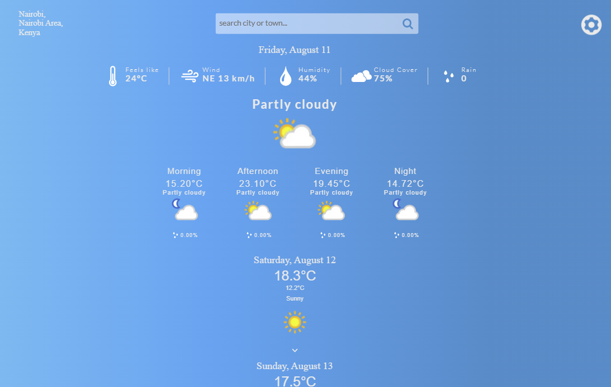

# Weather App

A web application that tells the user the weather based on their current location or by
searching for a town or a city.

The application is built with ReactJs.
The app powered by a weather API from RapidAPI and is hosted on Vercel.

